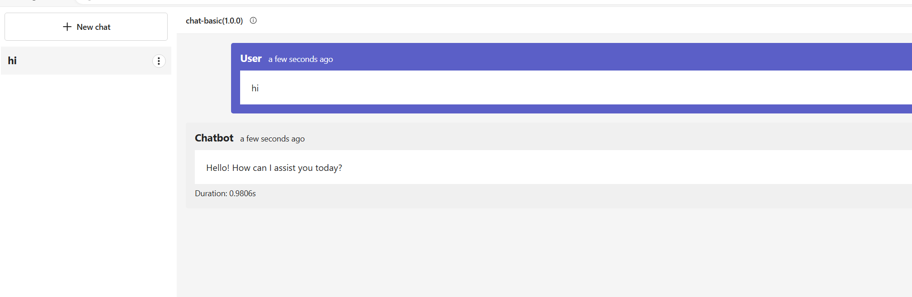

# Open Hack - Challenge 6: Deploy your WebApp

<p align="center">
    
</p>

This challenge is about deploying your WebApp to Azure based on the prompt flow previously created. You will learn how to containerized and deploy your WebApp to any Azure Service that supports a containerized application, like Azure App Services, Container Apps, Kubernetes, or other.

We will not deploy the webapp application using a devops pipeline, since the focus of this challenge is to create the webapp and not about all the CI/CD process. You can use Microsoft documentation with all the steps to create a pipeline to deploy your application, using Azure Devops or even Github.

### Pre-Requisites

* [Docker Desktop](https://www.docker.com/products/docker-desktop/) - (optional) to use dev containers locally.
* [Visual Studio Code](https://code.visualstudio.com) - recommended IDE for local development.
* [Azure Developer CLI (azd)](https://aka.ms/install-azd) - to manage Azure deployment.
* [Python 3.10+](https://www.python.org/downloads/) - to run, test & evaluate application.
* [Promptflow 1.10+](https://microsoft.github.io/promptflow/) - to build, evaluate, and deploy application flows.

You will also need:
* [Azure Subscription](https://azure.microsoft.com/free/) - sign up for a free account.
* [GitHub Account](https://github.com/signup) - sign up for a free account.
* [Access to Azure OpenAI](https://learn.microsoft.com/legal/cognitive-services/openai/limited-access) - submit form to request access.

## Development Environment

[](https://github.com/codespaces/new?hide_repo_select=true&machine=basicLinux32gb&repo=790752905&ref=main&devcontainer_path=.devcontainer%2Fdevcontainer.json&geo=EuropeWest&machine=standardLinux32gb)
[](https://vscode.dev/redirect?url=vscode://ms-vscode-remote.remote-containers/cloneInVolume?url=https://github.com/martaldsantos/AIAppsOpenHack)

The repository is instrumented with a [DevContainer](./.devcontainer/devcontainer.json),  configuration that can provide you with a _pre-built_ environment that can be launched locally, or in the cloud [GitHub Codespaces](https://docs.github.com/en/codespaces/overview). You can also elect to do a _manual_ environment setup locally, if desired. Here are the three options in increasing order of complexity and effort on your part. **Pick one!**

 1. **Pre-built environment, in cloud** with GitHub Codespaces
 1. **Pre-built environment, on device** with Docker Desktop
 1. **Manual setup environment, on device** with Anaconda or venv

    **Note**: When using GitHUb Codespaces, please select a machine with at least **4-core** and **16GB-RAM**, since this exercise needs this minimum requirements.

### About Prompt Flow

Prompt flow is a tool that allows you to create, manage, and deploy AI models as a flow. It is a visual tool that allows you to create a flow of AI models and deploy them as a single entity.

 * For more info see the [promptflow.md](./promptflow.md) file under this repo.


## Instructions

**Pré-req**
</br>
If you are running this challenge, install firstly the conda package (below instructions for linux installation) for windows see [installation](https://docs.anaconda.com/free/anaconda/install/):

```bash
mkdir -p ~/miniconda3
wget https://repo.anaconda.com/miniconda/Miniconda3-latest-Linux-x86_64.sh -O ~/miniconda3/miniconda.sh
bash ~/miniconda3/miniconda.sh -b -u -p ~/miniconda3
rm -rf ~/miniconda3/miniconda.sh
```

and then 

```bash
~/miniconda3/bin/conda init bash
```

After that, add a new terminal window and confirm conda is installed

```bash
conda -V
```

1. On visual studio code, or inside GitHub Codespaces, create two folders. A folder where you will save your prompt flow after downloaded from AI Studio (e.g. 'pf-src'), and a folder where your prompt flow will be ready to deploy and distribute after everything was configured (e.g. 'pf-dist').

2. Download the prompt flow code from AI Studio and extract it to the previously created folder ('pf-src').
    2.1. Unzip the `YourFlow.zip` file
 

3. Open the `pf-src` folder in Visual Studio Code.
   
    3.1. Create a new conda environment with the following command:
    ```bash
    conda create --name pf python=3.11
    ```
    3.2. Activate the conda environment with the following command:
    ```bash
    conda activate pf
    ```
    3.3. Install the required packages with the following command:
    ```bash
    pip install promptflow promptflow-tools azure.ai.ml
    ```


4. Go to the `Prompt Flow Extension` and click on `Connections`.

</br>

5. Set the connections provider to `Azure AI Connection and others services for local connections` and create an AzureML connection string.
</br>

6. Save the connections and refresh the page.

**Note**: If needed, you can create other connections like CosmosDB, Azure Search, etc using the [connections](./create-connections.ipynb) notebook using your env. file for the purpose with the specific keys.

you can check the connections by running the command below in the terminal:
```bash
pf connection list
```
For more info check the prompt flow page under [connections](https://microsoft.github.io/promptflow/reference/pf-command-reference.html#pf-connection)
</br>

7. Open the flow and set the connection to `Default_AzureOpenAI` and the deployment name to `gpt-35-turbo` if needed.
</br>

8. Save the flow.
</br>

9. Go to the `Flows` folder and click on `pf-src`.
</br>

10. Click on `Build` and then click on `Build as docker`.
</br>

11. Select the `pf-dist` folder and click on `Create Dockerfile`.

**Note**: if this step fails do it with pf cli (vscode somehow doesn't show errors, but the cli does)
```bash
    pf flow build --source src --output pf-dist --format docker
```
12. Open the `pf-dist` folder in Visual Studio Code.
</br>

13. Edit the `flow/requirements.txt` file and add the following lines:
```shell
promptflow
promptflow-tools
```

**Note**: Some other packages may be required (e.g. azure-cosmos,
azure-search-documents==11.4.0, azure-ai-ml, etc), depending on the flow. If you have any errors, check the logs and add the required packages to the `requirements.txt` file.
</br>

14. Save the file.
</br>
15. Update the `Dockerfile` to use the old version of the promptflow code.

**Optional**: If you want to use the latest version of the promptflow code, you can skip this step. Otherwise, you can use the following steps to use the old version of the promptflow code.

15.1. Add the following lines to the `Dockerfile`:

```
RUN wget -O /opt/conda/envs/promptflow-serve/lib/python3.9/site-packages/promptflow/_sdk/_serving/static/index.js https://raw.githubusercontent.com/microsoft/promptflow/ffa78b411ccedd42e95bb412d2d2e83afa6addc0/src/promptflow/promptflow/_sdk/_serving/static/index.js && wget -O /opt/conda/envs/promptflow-serve/lib/python3.9/site-packages/promptflow/_sdk/_serving/static/index.html https://raw.githubusercontent.com/microsoft/promptflow/ffa78b411ccedd42e95bb412d2d2e83afa6addc0/src/promptflow/promptflow/_sdk/_serving/static/index.html
```
</br>

## Test locally before containerizing the prompt flow 

Run the following command to test the prompt flow locally:
```bash
pf flow test --flow . --ui
```
or 
```bash
# Serve the flow at localhost:8080
pf flow serve --source <path-to-your-flow-folder> --port 8080 --host localhost
```

Note: If you have any errors, check the logs and fix them before containerizing the prompt flow.

If using pf version 1.11.0 (pf -v to see your version), when running the previously command, an endpoint for debug and tracing your prompt flow will be shown (e.g. http://127.0.0.1:23333/v1.0/ui/traces/?#collection=basic).


This endpoint is very useful to debug your prompt flow, since you can see the input and output of each step of your flow, and the spans of each step.


## Build and test the containerized prompt flow locally using Docker

16. Run the following command to build the docker image, using docker desktop (on dist directory):
```
docker build -t Yourflow .
```
</br>

17. Go to Azure Portal and under your Azure AI resource, hit the Show Keys and then copy the Key 1 value, since we will use it as environment variable to deploy the container.
</br>

18. Run the following command to run the docker image:
```
docker run -e DEFAULT_AZUREOPENAI_API_KEY=<key1> -p 8080:8080 Yourflow
```
**Note:** If you need more environment variables, you can add them using the `-e` flag (like for instance the CosmosDB key, or the SearchAI key).

e.g.:
```bash
docker run -e AOAI-CONNECTION_API_KEY=yourkey1 -e CONTOSO-COSMOS_KEY=yourkey2 -e CONTOSO-SEARCH_API_KEY=yourkey3 -p 8080:8080 yourImageName
``` 
</br>

19. Test the containerized application by running on browser:
``` 
http://localhost:8080
```
</br>

**Sample UI**:



20. Deploy the containerized application to service of your choice like Azure App Services, Container Apps, Kubernetes, or other.


## Deploy the containerized prompt flow to Azure App Services

21. Follow the steps below to deploy the containerized prompt flow to Azure App Services:

- loging into your subscription
- create a resource group
- create a container registry
- push the image to the container registry
- create an app service plan
- create an app service
- configure the app service to use the container image

**Note:** You can use the Azure CLI to perform the steps above. You can also use the Azure Portal to do it as well.

## Deploy the containerized prompt flow to Azure Container Apps

22. Follow the steps below to deploy the containerized prompt flow to Azure Container Apps:

- loging into your subscription
- create a resource group
- create a container registry
- push the image to the container registry
- create an Azure Container Apps
- configure the Azure Container Apps to use the container image


## Success Criteria

You will know you are successful when you have deployed your WebApp to Azure and you can access it locally through the browser.

## Resources

- [Azure CLI](https://docs.microsoft.com/en-us/cli/azure/install-azure-cli)
- [Docker Desktop](https://www.docker.com/products/docker-desktop)
- [Visual Studio Code](https://code.visualstudio.com/)
- [PromptFlow Extension](https://marketplace.visualstudio.com/items?itemName=Microsoft.promptflow)
- [Azure AI](https://azure.microsoft.com/en-us/services/machine-learning/)
- [Azure AI Search](https://azure.microsoft.com/en-us/services/search/)
- [Azure App Services](https://azure.microsoft.com/en-us/services/app-service/)
- [Azure Container Apps](https://azure.microsoft.com/en-us/services/container-app/)
- [Azure Kubernetes Service](https://azure.microsoft.com/en-us/services/kubernetes-service/)
- [Azure DevOps](https://azure.microsoft.com/en-us/services/devops/)
- [GitHub Actions](
https://docs.github.com/en/actions)
- [Microsoft Documentation](https://docs.microsoft.com/en-us/)
- [PromptFlow](https://github.com/microsoft/promptflow)
